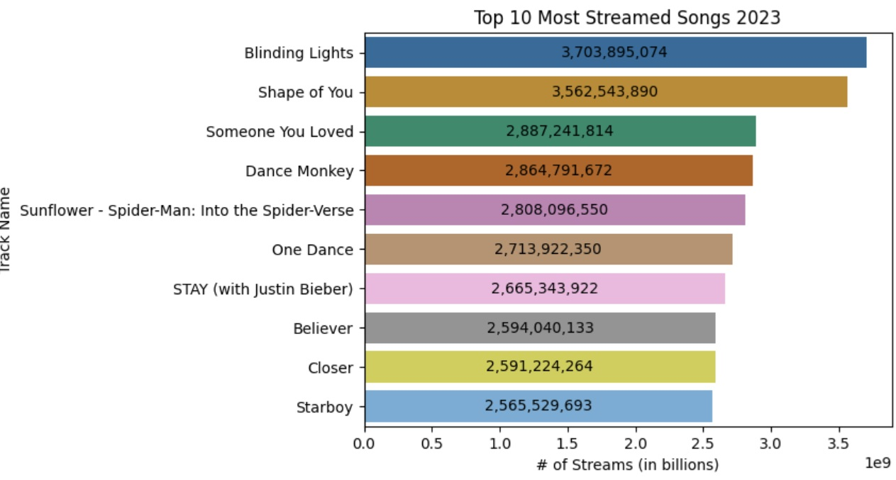
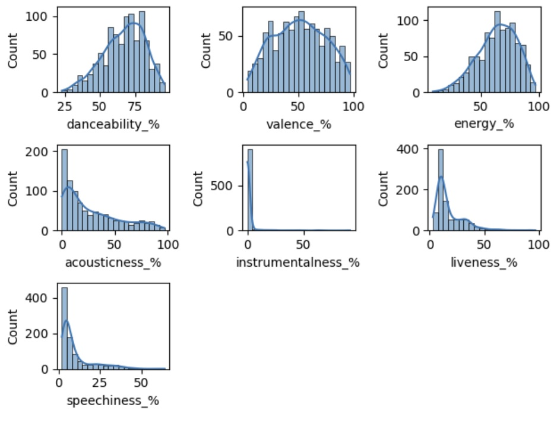

# Projects

## [NYPD Historic Arrests](https://github.com/kennyhj/nypd_arrests/tree/main)
 
 
- MySQL, Tableau
- Exploratory analysis of historic nypd arrest data (2006-2023)
- Dataset from [NYC OpenData](https://data.cityofnewyork.us/Public-Safety/NYPD-Arrests-Data-Historic-/8h9b-rp9u/about_data)
- Visualized metrics: the most common crime types, heat map of arrests, demographics of those arrested, and arrests per year, all on a [dashboard](https://public.tableau.com/app/profile/kenny.jeong/viz/NYPDHistoricArrests/NYPDArrestDashboard) that can be filtered by year

Final Conclusions:
 - Black men age 25-44 account for the highest number of arrests, despite being the 3rd highest population in NYC. This discrepancy highlights a possible racial bias in policing.
 - Arrest rates spiked in 2020 after about a decade of decline. I would suggest further stuidy into the effects of the covid-19 on crime

## [Top Spotify Songs of 2023](https://github.com/kennyhj/spotify2023)

- Jupyter Notebook, Python (Pandas, Numpy, Matplotlib, Seaborn)
- Exploratory data analysis of the top streamed Spotify songs of 2023
- Finding patterns in the top streamed songs to find the characteristics we need to make a viral song
- Dataset from [kaggle](link)
- Analyzed: top streamed songs, artists, keys, modes, release years, song qualities, bpm, and playlists

Final Conclusions:
 - Qualities we want for the next viral song: C# major key, high danceability, energy, 90-120 bpm, addition to many Spotify playlists
 - Further useful insights to pursue: genres, TikTok sound usage, and YouTube data
